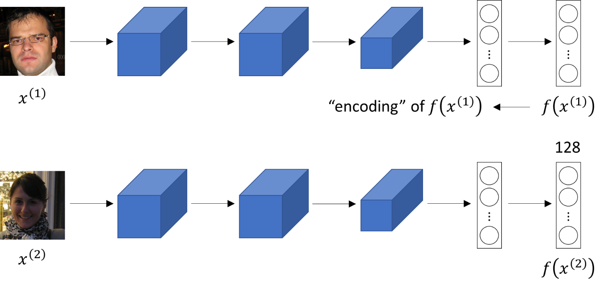
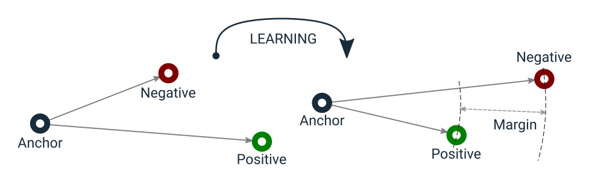

# Siamese Network for ISIC 2020 s4786177

Student: Jay Thakkar  
Student number: s4786177
## Abstract

The goal was to build a binary classifier (normal vs melanoma) for the ISIC 2020 dermoscopic image dataset using a Siamese-style approach: a shared ResNet50 backbone produces embeddings that are passed to a small MLP classification head. The classifier was trained with cross-entropy on image-level labels and evaluated on a held-out test set. This repository contains the dataset handling, training, evaluation and plotting utilities used to reproduce experiments and generate the key figures.

## Files of interest

- `dataset.py`: data loading, preprocessing, augmentation, stratified train/val/test split and balanced sampler.
- `modules.py`: model components: `FeatureExtractor` (ResNet50 + MLP projection head), `ClassifierHead` (linear classification head), and `SiameseNet` wrapper.
- `train.py`: training loop (cross-entropy), metrics logging, save-best checkpoint by validation AUC, and training plots.
- `predict.py`: load best checkpoint, evaluate on test set, compute AUC/accuracy/Youden threshold, and save ROC/confusion/t-SNE plots.

The Siamese-style network uses a shared feature extractor (ResNet50) to produce low-dimensional embeddings for input images. The embeddings are passed through a small MLP head to produce 2-class logits (normal / melanoma). During training the model is optimized with standard cross-entropy loss. Training, evaluation and inference scripts (`train.py`, `predict.py`) produce plots (loss, accuracy, AUC, confusion matrices, and t-SNE) saved under the `reports/` folder.


##  Model Architecture Details: The WSiamese Network Design
The network is structured as a Siamese architecture, utilizing a single, shared set of weights across two conceptually parallel branches (for metric learning). The primary goal is to simultaneously optimize for image classification and a highly structured, discriminative feature space.

The model, wrapped by SiameseNet, comprises a sequential arrangement of two modules: the Feature Extractor and the Classifier Head.

### What is a Siamese neural network

A Siamese Network is a specific type of neural network architecture designed not for general classification, but generally for similarity measurement and metric learning between two inputs(reference). As illustrated in the provided diagram , the network consists of two or more identical subnetworks (often referred to as "twins") that are constrained to share the exact same set of weights and configuration. When two input images, such as a pair of skin lesions are fed into the network, each subnetwork processes its image independently to produce a corresponding high-dimensional feature vector, known as an embedding. Because the weights are shared, the network learns a mapping where if the two input images are inherently similar (e.g., both are benign lesions), their resulting embeddings will be located very close together in the feature space. Conversely, if the images are dissimilar (e.g., one benign and one malignant), their embeddings will be spatially distant (farther away). The final stage involves calculating a distance metric (like Euclidean or cosine distance) between these two output embeddings to quantify their similarity score. This inherent structure makes the Siamese model highly effective for tasks like the lesion classification in the dataset, where minimizing the distance between same-class embeddings enhances the model's fundamental ability to discriminate and learn robust class boundaries.

> insert image of architecture diagram here (yet to do)

### Feature Extractor
This module is responsible for projecting the raw input image into a compact, low-dimensional vector space.Backbone (ResNet50): A ResNet50 network, pretrained on ImageNet, serves as the foundational backbone. Transfer learning is employed by loading the ImageNet weights to leverage learned hierarchical visual features. The standard 1,000-class classification layer is replaced with `nn.Identity().Output`: The output from the global average pooling layer yields a 2048-dimensional feature vector.
### Projection Head (MLP): 
Projection Head (MLP)The Projection Head is a small Multi-Layer Perceptron (MLP) defined in modules.py that refines the 2048-dimensional output from the ResNet50 backbone into the final, smaller embedding. Its job is to compress and structure the features.Structure: The head uses a three-layer sequence of transformations:Python# from modules.py
```python
self.head = nn.Sequential(
    nn.Linear(2048, 512),
    nn.ReLU(inplace=True),
    nn.Dropout(drop), # drop=0.6 by default
    nn.Linear(512, 256),
    nn.ReLU(inplace=True),
    nn.Dropout(drop),
    nn.Linear(256, emb_dim), # emb_dim=128 by default
)
```
- The Linear layers perform the compression: 2048 -> 512 -> 256 -> 128.
- ReLU provides the necessary non-linearity, and Dropout (p=0.6) acts as a regularization technique to prevent overfitting
- Initialization: The weights of these linear layers were specifically initialized using Kaiming normal initialization (He initialization), a standard practice for layers followed by ReLU, to ensure stable learning at the start of training.
- Final Embedding: The final output is the 128-dim embedding vector. This vector is L2-normalized using `torch.nn.functional.normalize` in the FeatureExtractor's forward pass. This normalization is required because the Triplet Loss component relies on a distance calculation in a normalized feature space.

## Dataset and preprocessing
The initial ISIC 2020: Skin Cancer Detection challenge provided a large collection of high-resolution dermoscopic images. However, a pre-processed version was adopted to facilitate faster training and resource efficiency. This version contains image files resized to a fixed resolution of 224x224 along with the associated metadata in `train-metadata.csv`. The important fields in the metadata are the unique image identifier (`isic_id`), a randomized `patient_id`, and the `target` column, which provides the binary class label: benign (0) or malignant (1). This dataset was then further divided in `dataset.py` using stratified sampling to create the 80/10/10 train, validation, and test splits. Given the class imbalance, the training set employs a weighted sampler to ensure equal representation of both classes in each batch, mitigating the issue.

### Oversampling minority class
Oversampling was used during training to deal with the strong class imbalance in the melanoma dataset, where there are many more benign (non-cancerous) images than melanoma (cancerous) ones. Without balancing, the model would mostly see benign examples and could easily learn to always predict "benign," which would look accurate but fail to detect real melanomas. To fix this, the data loader in dataset.py uses a `WeightedRandomSampler`, which increases the chances of selecting melanoma images so that each training batch contains a more even mix of both classes. This helps the model learn what makes melanomas different instead of being biased toward the majority class. Oversampling is especially important here because the model also uses metric learning (Triplet Loss), which compares examples from both classes. Balanced batches ensure that the model always has enough positive and negative examples to learn useful differences between them. 
### Image Augmentations

The Siamese Network was trained using various image augmentation techniques, defined within the `get_transforms` function in `dataset.py`. This was important for improving the model's resilience and preventing overfitting which is a valid concern given the high class imbalance in the dataset. The main training transform, `train_t`, applies sequential augmentation steps: It uses a RandomResizedCrop to $224 \times 224$ pixels, which applies a scale variation (between $0.85$ and $1.0$) and positional shifts. This is followed by RandomHorizontalFlip and RandomVerticalFlip (both with a $p=0.5$ probability), and RandomRotation (up to $15^\circ$). These spatial transformations ensure the model learns to recognise the correct class independent of the lesion's orientation. Additionally, ColorJitter is applied with small variations in brightness ($0.10$), contrast ($0.10$), saturation ($0.05$), and hue ($0.02$). The final steps convert the image to a PyTorch Tensor and apply standard ImageNet normalization.

```python
# from dataset.py -> get_transforms
train_t = transforms.Compose([
    transforms.RandomResizedCrop(224, scale=(0.85, 1.0)),
    transforms.RandomHorizontalFlip(p=0.5),
    transforms.RandomVerticalFlip(p=0.5),
    transforms.RandomRotation(degrees=15, fill=0),
    transforms.ColorJitter(brightness=0.10, contrast=0.10, saturation=0.05, hue=0.02),
    transforms.ToTensor(),   # convert PIL image to torch.FloatTensor [0,1]
    norm                     # normalize channels to mean/std
])
```
Insert image: dataset samples (example benign / malignant images)

## Loss function
The model is trained with a multi-task loss that combines classification and metric-learning objectives. The total loss is a weighted sum of the Cross-Entropy loss and the Batch-Hard Triplet loss.

- Cross-Entropy Loss (loss_ce): the standard classification loss computed on the logits produced by the `ClassifierHead`. In the code this is implemented as `loss_ce = ce(logits, y)` and encourages correct class predictions.

- Batch-Hard Triplet Loss (loss_tri): a metric-learning loss computed on the L2-normalized feature embeddings returned by the `FeatureExtractor`. he core idea is based on triplets (Anchor, Positive, Negative), as shown in the diagram : an Anchor image must be closer to a Positive image (same class) than it is to a Negative image (different class) by a margin (default `triplet_margin = 0.2`).
    - Batch-hard mining: implemented in `_batch_hard_triplet_loss` in `train.py`. The strategy selects the hardest triplet within the batch: for each Anchor, it finds the farthest Positive example and the closest Negative example. This intentional focus on the most challenging embeddings significantly improves the local separation around the decision boundary in the embedding space.





The final loss used for backpropagation is:

`loss = loss_ce + lambda_triplet * loss_tri`

where `lambda_triplet` (default `1.0`) weights the triplet loss so that both classification and metric-learning objectives contribute to optimization.

## Training, evaluation and saved outputs

Running `train.py` will train the model and save the best checkpoint (by validation AUC) to `siamese_ce.pt` (or the `save_path` you pass). The script also writes per-epoch plots to `reports/` (loss, accuracy, AUC). Example outputs generated by the repository include:

- `reports/ce_loss.png` — Cross-entropy loss curves (train vs val)
- `reports/ce_acc.png` — Accuracy curves
- `reports/ce_auc.png` — AUC curves
- `reports/test_roc.png` — ROC plot from `predict.py` evaluation
- `reports/test_confusion_matrix_argmax.png` — Confusion matrix at argmax
- `reports/test_confusion_matrix_threshold.png` — Confusion matrix at Youden threshold
- `reports/test_tsne.png` — t-SNE of test embeddings (optional)

Example usage (from project folder):
yet to do

## Interpreting the results
The following graphs display the results obtained when running the train.py and predict.py files (see below for details on how to run).

### Accuracy over epochs 


- This graph tracks the classification correctness Correct Predictions / Total samples for both the Train set (blue line) and the Validation set (orange line) across the 10 training iterations (epochs).
- The Y-axis represents the percentage of images correctly classified. The Train Accuracy shows the model's performance on the data it is actively learning from, while the Validation Accuracy shows how well the model generalizes to unseen data.
- The Train Accuracy rises steadily, finishing near perfect (~97.5). However, the Validation Accuracy peaks at Epoch 2 and again at Epoch 9 (~95.5) but shows significant dips and instability in between. This large and growing gap between the two curves is a clear visual indicator of overfitting after the initial few epochs.

### AUC Over Epochs


- This plot tracks the Area Under the ROC Curve (AUC), which measures the model's overall ability to discriminate between the two classes (Normal vs. Melanoma) across all possible thresholds.
- An AUC close to 1.0 is ideal. The Validation AUC is the metric used to determine the best model checkpoint because it assesses generalization power.
- Model interpretation: The Validation AUC peaks highest at Epoch 2 (0.908) and then decreases sharply before recovering slightly late in training. This confirms that the model's best discriminatory power on unseen data was achieved very early. Although the Train AUC continues toward 1.00, the decline in Validation AUC confirms that the model was learning training-specific noise rather than generalizable features, supporting the choice of the Epoch 2 checkpoint.

### Loss over epochs

- This graph displays the magnitude of the Joint Loss (Cross-Entropy + Triplet Loss) that the model is minimizing on both the training and validation sets.
- Lower loss is better. The Validation Loss serves as a proxy for how well the model's combined classification and metric learning objectives are being achieved on unseen data.
- The Train Loss decreases consistently, showing the optimization process is successfully driving the total loss down on the training data. The Validation Loss is erratic and does not consistently drop, again reinforcing that the model is having trouble minimizing the combined loss objective for new data points after the first few iterations, which is typical of early overfitting.

### Confusion Matrix (argmax) 

- This matrix shows the raw prediction counts on the test set using the default 0.5 probability threshold, representing the standard accuracy classification.
    - True Negatives (TN) = 2836: Correctly classified Benign cases.
    - False Positives (FP) = 419: Benign cases incorrectly called Melanoma (False Alarms).
    - True Positives (TP) = 44: Correctly classified Melanoma cases.
    - False Negatives (FN) = 14: Melanoma cases incorrectly called Benign (Missed Cancers).
- This matrix shows a highly conservative model, resulting in a large number of True Negatives but 14 dangerous False Negatives. This threshold is sub-optimal for medical screening as it prioritizes overall accuracy over patient safety.

### Confusion Matrix (Youden threshold)

- This matrix shows the raw prediction counts on the test set using the Youden Threshold (0.2192), which is the clinically optimized probability cutoff that maximizes Sensitivity + Specificity.
    - True Negatives (TN) = 2639: Correctly classified Benign cases.
    - False Positives (FP) = 616: Benign cases incorrectly called Melanoma (increased False Alarms).
    - True Positives (TP) = 50: Correctly classified Melanoma cases.
    - False Negatives (FN) = 8: Melanoma cases incorrectly called Benign (significantly reduced Missed Cancers).
- By lowering the threshold to 0.2192, the model accepts an increase in False Positives (from 419 to 616) in order to achieve the critical result: the number of False Negatives is cut almost in half (from 14 to 8). This demonstrates that the model, when optimally calibrated, achieves a desirable clinical trade-off, maximizing the detection of the disease (Sensitivity = 86.2%).

## Dependencies (recommended)

- Python >= 3.8
- torch >= 1.11 (CUDA-enabled build if using GPU)
- torchvision >= 0.12
- pandas >= 1.3
- scikit-learn >= 1.0
- pillow >= 8.0
- matplotlib >= 3.4
- tqdm >= 4.60

The reproducible environment can be recreated using:

```powershell
python -m venv .venv; .\.venv\Scripts\Activate.ps1
pip install pip==23.0.1
pip install torch torchvision pandas scikit-learn pillow matplotlib tqdm
```

Set the random seed (the repo already sets seeds) by calling `set_seed(s)` — scripts call `set_seed(42)` by default to improve reproducibility. Note that GPU/cuDNN non-determinism can still cause minor run-to-run variation; to increase determinism further you can disable `torch.backends.cudnn.benchmark` and set `torch.backends.cudnn.deterministic = True` (may reduce performance).


## Results and expected performance

The project was designed to target around 0.8 test accuracy (when trained end-to-end with the provided augmentations and balanced sampling). Final results depend on training hyperparameters, number of epochs, GPU availability and dataset version.

Insert image: example training plots (loss/acc/auc)

r to `train.py`/`predict.py` so the commands above can be run without modifying the scripts. 
# Siamese Network - s4786177

Student: Jay Thakkar
Student number: s4786177
